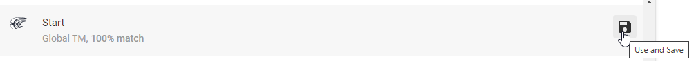

# Oversæt Loopdocs

Denne guide vil forklare, hvordan du kan hjælpe med at oversætte Loopdocs.

Kontroller først om dit sprog er på Loopdoc sprogside. Sproget siden kan findes her: [Loopdocs sprogside](https://loopdocs.github.io/loopdocs/)

Hvis dit sprog er opført her, er oversættelsesprojektet allerede opsat, og du kan blive medlem af oversættelsesteamet ved at følge vejledningen nedenfor.

!!!note "Is your language not there?"

    Hvis dit sprog ikke er listet og du gerne vil begynde at oversætte Loopdocs til et nyt sprog, opret venligst et 'issue' på github  [her](https://www.github.com/LoopDocs/loopdocs/issues/new?title=New language request&body=Can you please add [ENTER COUNTRY] for translation.).
    
    Oversættelsesteamet vil derefter konfigurere det for dig. Når den er klar til oversættelse, giver vi dig besked i issuet, og så kan du blive en del af Crowdin-teamet.

## Bliv en del af Crowdin-teamet

1. Gå til [Crowdin](https://crowdin.com/project/loopdoctranslation)
2. Log ind (eller tilmeld dig ved at oprette et nyt login eller bruge din github, facebook eller anden konto)
3. Vælg dit sprog
4. Vælg en fil, der skal oversættes.

Og så er du klar til at begynde at oversætte.

Hvis du ikke har brug crowdin før der er en kort introduktion til Crowdin nedenfor.

Hvis du ønsker en mere detaljeret forklaring på, hvordan du bruger Crowdin, kan du [Crowdin - for oversættere](https://support.crowdin.com/online-editor/)

## Crowdin introduktion

Når du har valgt dit sprog og en fil, åbnes Crowdin-editoren.

Crowdin-editoren har 5 hovedområder, som er fremhævet nedenfor: 

**1. Document to translate** - indeholder alle sætninger i dokumentet. Du oversætter en sætning ad gangen.</0> Du kan klikke på den sætning, du vil oversætte. Når du klikker på en sætning, ændres de fire andre områder.

Sætningerne er farvet i:

- Rød: Sætninger, der skal oversættes.
- Gul: den sætning, du oversætter.
- Grøn: Sætninger, der er blevet oversat.

**2. Sentence you are translating now** - Viser den sætning du har valgt i dokumentet.

**3. Enter translation here** - det er her du indtaster din oversættelse. Når du har indtastet din oversættelse klik på gem knappen. Crowdin vil derefter tage dig til næste sætning.

!!!important "Save your work!"

    Husk at klikke på gem-knappen ellers din oversættelse vil ikke blive gemt.

**4. Suggested translation of the sentence** - her vil du se en liste over sætninger, som Crowdin foreslår at bruge til din oversættelse. Du kan endda se oversættelsen til andre sprog nederst på listen. Hvis du ønsker at bruge den foreslåede oversættelse, kan du blot klikke på den og sætningen bliver overført til "Enter your translation". Derefter kan du redigere sætningen og klikke på gem. Hvis du bare ønsker at bruge den foreslåede sætning og ikke redigere det, kan du blot klikke på "Use and save".

**5. Comments** - Her kan du indtaste kommentarer om den oversættelse, du laver. Andre brugere kan se det, og du kan have en diskussion om brugen af sætningen.

!!!info "All translators read the comments"

    It is standard practice to use the source language for comments in this case you should use english.

## To translate or not to translate

In most files there is sections the text "!!!note" or "!!!danger" or something other text with "!!!" in front. It is shown like this in Crowdin:

You should NOT translate the text just after the "!!!" in this case "warning", but you should translate "FAQs" in this case. Sometimes there is no text after "!!!warning" you should still NOT translate this. Some of Crowdins translation suggestions would like to translate the "warning" text.
