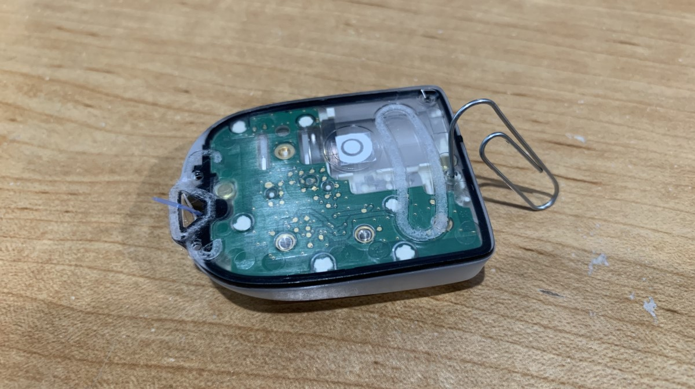

# Omnipod FAQs

## Wird Omnipod von Loop untersützt?

JA, ES WIRD!!! WOOHOO!!

## Welche Pods funktionieren mit Loop?

Die in dieser Dokumentation beschriebene Loop-App (sog. DIY Loop) arbeitet mit den Eros Pods zusammen. Die neueren DASH Pods werden nicht von der DIY-Loop unterstützt. [Tidepool](https://www.tidepool.org/) ist damit gestartet, die [DIY Loop bei der FDA als Hilfsmittel bestätigen zu lassen](https://tidepool.org/blog/tidepool-delivering-loop) und die Firma Insulet wurde als [erste Partnerfirma für Pumpen](https://diatribe.org/omnipod-first-insulin-pump-partner-tidepool-loop) angekündigt. Die Tidepool Loop wird die DASH Pumpe verwenden, ohne einen RileyLink zu benötigen.  Wenn du über den Fortgang informiert werden willst, kannst du dich [hier](https://tidepool.org/loop) für den Newsletter anmelden.

Liste möglicher Systeme:

* DIY Loop + Eros pods + RileyLink  
* Tidepool Loop + DASH Pods ohne RileyLink

## Brauche ich immer noch den PDM mit der Omnipod Loop?

Nein. Pods sind monogame kleine Kreaturen. Sie paaren sich aus Sicherheitsgründen nur mit einem einzigen Gerät. Ein Pod kann also nur entweder mit deinem PDM oder der Loop-App auf deinem iPhone zusammenarbeiten. Mit anderen Worten, der PDM kann in der Schublade bleiben, während du loopst. Du kannst deinen Pod nicht mit deinem PDM steuern, wenn du ihn mit der Loop-App aktiviert hast. Das heisst aber nicht, dass du deinen PDM loswerden kannst. Instead, keep it for backup situations if you lose your phone. Weiter unten findest du Hinweise was zu tun ist, wenn du dein iPhone oder deinen RileyLink verlierst.

## Kann ich eine von Loop gesetzte temporäre Basalrate abbrechen? Wie sieht es mit einem Bolus aus?

Ja, du kannst eine temporäre Basalrate oder einen Bolus jederzeit abbrechen. Du erreichst den "Abgabe unterbrechen" Knopf durch Tippen auf auf [das Pod-Alter-Icon](../operation/loop-settings/displays.md#pod-age-omnipod-users) im Head-UP-Display in der oberen rechten Ecke. Das Abbrechen der Insulinabgabe stoppt jede laufende temporäre Basalrate oder Bolusabgabe. The suspend command will run indefinitely. So lange die Insulinabgabe gestoppt ist, wird eine Banner-Benachrichtigung auf der Hauptansicht der Loop-App angezeigt.

Die Insulinabgabe bleibt solange gestoppt, bis der Benutzer etweder auf der Hauptansicht auf "Tap to Resume" tippt oder über das Pod-Alter Icon den "Abgabe fortsetzen"-Befehl startet. Sobald die Insulinabgabe fortgesetzt wird, wird wieder die normale zeitliche Basalrate angewendet. Falls ein Bolus unterbrochen wurde, wird dieser nicht fortgesetzt. Solltest du innerhalb der nächsten fünf Minuten nicht auf "Open Loop" umschalten, wird die Loop-App automatisch die temporäre Basalrate einstellen.

## Kann ich meine eigenen temmporären Basalraten einstellen?

No. No. No. No. No. No. Loop does not allow you to pick your own temp basal rate or prime insulin in.

Solltest du dich in einer Situation befinden, in der du deine eigenen temporären Basalraten benötigst, könntest du (1) deine momentane Basalrate für die benötigte Zeit anpassen oder zuerst die momentan laufende temporäre Basalrate durch Stoppen und Fortsetzen der Insulinabgabe abbrechen und dann für die Zeit, für die du deine spezielle Basalrate benötigst, in den "Open Loop" Modus umschalten, um dann die benötigte Basalrate von Hand einzustellen.

## Was passiert, wenn ich mein Telefon oder RileyLink verliere?

Bei Pod-Benutzern wird der Pod die momentan laufende temporäre Basalrate bis zum Ende laufen lassen (maximal eine halbe Stunde) und dann auf die normale Basalrate zurückschalten. Allerdings kannst du ohne Telefon oder RileyLink nichts am Pod einstellen, keine Basalratenänderung, -abbruch oder fortsetzen, oder Bolusabgabe. Um irgendetwas anderes mit dem Pod zu tun, außer Basalabgabe, musst du je nach Situation handeln.

* Nur den RileyLink verloren: Du kannst den verlorenen RileyLink mit einem anderen aus deinem Nachschub ersetzen. Es gibt kein Problem beim Wechseln des RileyLinks inmitten einer Pod-Session. Solltest du allerdings keinen Ersatz-RileyLink zur Hand haben, musst du den aktuellen Pod durch einen neuen, mit deinem PDM aktivierten, Pod ersetzen und zwar so lange, bis du einen neuen RileyLink hast.

* Nur das iPhone verloren: Du musst den Pod durch einen neuen, mit deinem PDM aktivierten Pod ersetzen und zwar so lange, bis du ein neues iPhone und die Loop-App aufgespielt hast.

* RileyLink und iPhone verloren: Du hast einen wirklich schlechten Tag! Du brauchst eine Umarmung und solltest den Anweisungen im vorgerigen Punkt befolgen, als hättest du nur dein iPhone verloren.

## Gibt es eine Häufung der Pod-Fehler mit der Loop-App?

In der Anfangszeit der Entwicklung gab es diese. Dank der harten Arbeit von Pete Schwamb und anderen gibt es diese Häufung von Pod-Fehlern bei normalem Gebrauch im Vergleich zu einem mit dem PDM aktivierten Pod nicht mehr.

## Was soll ich machen, wenn die Aktivierung des Pods fehlschlägt?

Die meisten Fehler beim Pod mit der Loop-App treten während des Aktivierungsprozesses auf. Sollten bei dir Fehler bei der Aktivierung auftreten, solltest du dir [diese Seite](../troubleshooting/pod-pairing.md) anschauen, die dir Möglichkeiten aufzeigt, wie du das Problem beheben kannst, bevor du den Pod verlierst.

## Was kann ich tun, um einen schreienden Pod zu stoppen?

Screaming pods can be silenced by carrying a paperclip. Einfach ein Ende der Büroklammer in das kleine Loch auf der Unterseite des Pods stecken (die Seite, auf der sich die Kanüle befindet), wie auf dem Bild gezeigt. Drücke die Bürklammer so weit rein, bis du einen kleinen Klick hörst. Dieser Klick zerbricht ein Bauteil und lässt das akustische Schreien verstummen.

