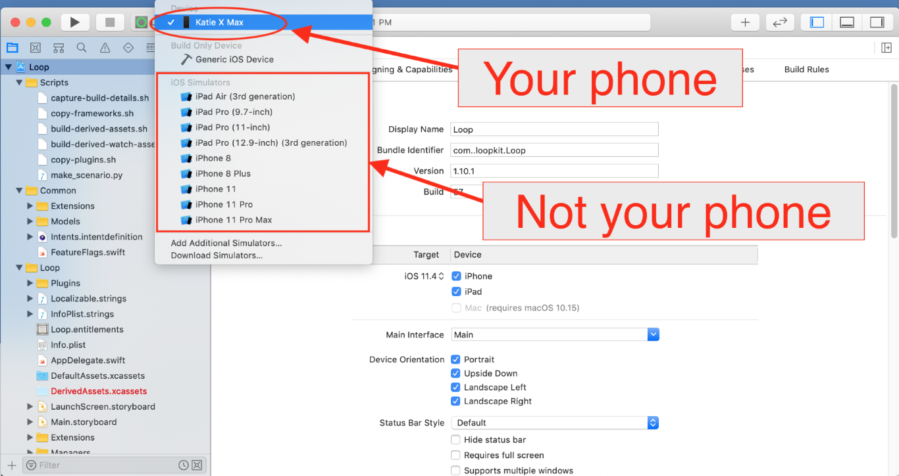
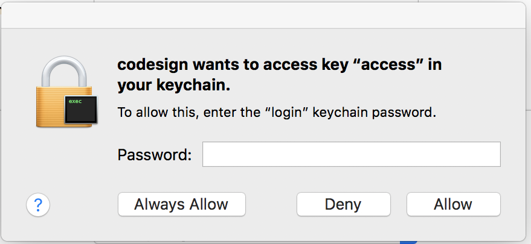

# Étape 14 : Créer l'application Loop

!!!danger "Temps estimé"
    - 60-80 minutes si c'est la première fois
    - 10-15 minutes si c'est une compilation répétée

!!!info "Résumé"
    - Ouvrez le code Loop que vous avez téléchargé dans [l'étape 13](step13.md)
    - Connectez le téléphone à l'ordinateur
    - Réglez le téléphone pour ne pas se verrouiller pendant un certain temps
    - Faire confiance à l'ordinateur (sur le téléphone)
    - Sélectionnez votre téléphone dans la liste des appareils
    - Enregistrer l'appareil
    - Signer les 4 cibles
    - Appuyez sur le bouton build
    - Entrez le mot de passe de l’ordinateur quatre fois pendant la construction (si c’est votre première génération)
    - Regardez avec admiration car vous venez de construire votre propre application Loop

!!!warning "FAQs"
    - **« J'ai une erreur de compilation ! Aïe... que dois-je faire?"** consultez la page [Erreurs de compilation](build_errors.md) pour toutes les solutions dont vous avez besoin.
    - **« La construction semble prendre beaucoup de temps, est-ce normal ? »** Oui, la première version d'un nouveau téléchargement prendra beaucoup de temps. Juste soyez patient... une des étapes de construction pour prendre *beaucoup* de plus que tous les autres. Le processus de compilation se termine toujours par un message de succès ou d'échec, alors attendez qu'il s'affiche jusqu'à ce que vous voyez l'un des messages affichés.

## Ouvrir le projet Loop dans Xcode

Allez dans votre dossier Téléchargements, ouvrez le dossier de code Loop téléchargé et double-cliquez sur Loop.xcodeproj. Si vous avez téléchargé la branche de développement, votre dossier s'appellerait `Loop-dev` et de même pour le téléchargement de `Loop-master`.

Un avertissement peut apparaître vous demandant si vous voulez vraiment l'ouvrir, cliquez sur Ouvrir. Xcode va s'organiser, cela peut prendre quelques minutes.

Une fois l'indexation terminée, les différents dossiers et fichiers du projet Loop apparaîtront dans la colonne de gauche. Nous allons maintenant faire trois séries de clics importants:

1. Premier clic : En haut de tous les dossiers et fichiers listés, cliquez sur le "Loop" bleu. Cela va remplir la partie centrale de la fenêtre Xcode avec quelques informations. **Si quelques petites boîtes apparaissent en disant « Le dossier « DerivedWatchAssets.xcassets » n’existe pas. » ... il suffit de cliquer sur les boutons ok et les ignorer. Ils apparaitreront plusieurs fois pendant votre compilation si vous utilisez la branche de développement en ce moment...ne vous inquiétez pas, ne sera pas un problème.**

2. Deuxième (ensemble de clics) : cliquez maintenant sur la case de l'écran du milieu pour révéler la colonne des Projets et Cibles sous cette boîte. Les quatre objectifs que nous allons signer dans les prochaines étapes sont maintenant facilement visibles. Maintenant, cliquez également sur la cible Loop comme indiqué dans la capture d’écran ci-dessous. Il sera surligné en bleu pour vous dire qu'il est sélectionné. Loop, Loop Status Extension, Watch App, and WatchApp Extension sont les cibles qui nous intéressent.

3. Troisième clic : Avec la cible Loop sélectionnée, cliquez sur les "Signing & Capabilities" près du haut de l’écran (dans les onglets). Après avoir cliqué sur cela, vous devriez voir une section « Signing » qui occupe la majeure partie de votre fenêtre centrale. Si vous avez manqué la section "Signing & Capabilities" et que vous n'avez pas trouver ou cliquer pour voir cette partie...cela signifie que vous avez manqué la mise à jour vers Xcode 11 à partir d'une ancienne version de Xcode. Veuillez revenir en arrière et mettre à jour Xcode maintenant. Merci.

## Connectez votre iPhone à l’ordinateur

Connectez votre iPhone par câble à l'ordinateur, sélectionnez votre iPhone en haut de la liste déroulante.  Votre **nom personnel de l’iPhone** devrait être en haut de la liste. Ne sélectionnez pas accidentellement les simulateurs génériques iOS listés sous le nom de votre iPhone.

!!!info "Conseils utiles"

    - Si votre iPhone est verouillé, Xcode ne sera pas en mesure d’installer l’application Loop qu'une fois que votre téléphone est déverrouille pendant la progression de la compilation.  Veuillez désactiver temporairement le verrou jusqu'à ce que vous ayez terminé la construction de l'application Loop.  Allez dans les paramètres de votre iPhone >> Affichage & Luminosité >> Verrouillage automatique et définissez-le sur `Jamais`.  Vous pouvez réactiver votre verrouillage une fois que Loop est installé sur le téléphone. Si vous ne pouvez pas ou ne voulez pas régler le verrouillage automatique à jamais, alors s’il vous plaît n’oubliez pas d’appuyer sur l’écran de votre téléphone périodiquement pendant le processus de construction pour le garder « éveillé ».  
    - Si c'est la première fois que votre iPhone est branché sur cet ordinateur, vous devrez ouvrir l'iPhone et sélectionner "Faire confiance à cet ordinateur" avant que votre appareil soit utilisable dans la sélection du menu.  

!!!danger "Erreur la plus courante"

    - L'erreur la plus courante dans cette étape est de ne pas sélectionner votre téléphone comme indiqué dans la deuxième capture d'écran ci-dessous. La liste par défaut n’est qu’un nom de modèles de téléphones généraux rattaché à la partie « simulateurs iOS »... ne vous y trompez pas. Votre téléphone ACTUEL sera au-dessus de la liste des différents modèles de téléphones du simulateur.  Vous devrez peut-être faire défiler vers le haut de la liste afin de le voir.  Assurez-vous de sélectionner votre téléphone actuel, pas seulement un modèle de téléphone de simulateur.

## Signer les 4 cibles (targets)

Une fois que vous avez sélectionné votre appareil (nom de votre iPhone), nous sommes prêts à signer les quatre cibles. Nous commencerons par la cible Loop, la première sur la liste des cibles.  Dans la zone « Signing », assurez-vous d’avoir « All » sélectionnés près du haut, puis sélectionnez le menu défilant où on peut lire actuellement « aucun ». Choisissez votre équipe avec qui vous souhaitez signer. Si vous sélectionnez un nom d’équipe avec (équipe personnelle/personal team), votre application expirera dans 7 jours. Si vous sélectionnez un nom d'équipe sans (équipe personnelle/personal team), votre application durera une année complète.  Si vous ne vous êtes jamais inscrit à un compte de développeur gratuit, vous n’aurez pas d’affichage (équipe personnelle/personal team). Assurez-vous de garder la case "Gérer automatiquement la signature/Automatically manage signing" cochée au-dessus de la zone de sélection de l'équipe.

Une fois que vous aurez choisi votre équipe de signature, Xcode générera automatiquement des profils d’approvisionnement et des certificats de signature.  Si c'est la première fois que vous construisez sur cet iPhone avec ce compte développeur, vous pouvez être invité à enregistrer l'appareil.  Il vous suffit de cliquer sur le bouton « Enregistrer l'appareil » pour confirmer.

!!!danger "Utilisateurs du compte développeur gratuits: LISEZ-MOI

    Si vous utilisez un compte développeur gratuit pour signer vos cibles, vous devrez faire une étape supplémentaire. En tant que développeur gratuit, il vous est interdit de construire des applications qui ont des fonctionnalités de notification Siri ou push intégrées. Loop a ces deux capacités... vous devrez donc les désactiver avant de procéder à la signature et à la construction de votre application. La fonction de notification push est utilisée pour définir les remplacements à distance ; la désactivation n'affectera pas les notifications normales (comme celles pour Loop qui n'arrive pas à effectuer sa boucle). Cliquez sur le petit x à côté de Siri et poussez les lignes de notification situées au bas de votre page Signing & Capabilities. Vous devez le faire à la fois dans les parties de l'extension Loop et WatchApp.
    
    

    
    

Une cible signée avec succès aura un profil d’approvisionnement et un certificat de signature similaire à la capture d’écran ci-dessous.  Cliquez sur chacune des trois cibles restantes, et répétez les étapes de signature en choisissant le même nom d'équipe que vous avez sélectionné dans la première cible.

## Personnalisations du code

**Nouveaux utilisateurs de Loop**: Les personnalisations ne sont pas une partie nécessaire pour la construction de Loop. Au fur et à mesure que vous gagnerez de l'expérience dans la façon dont vous utilisez votre application Loop, vous voudrez peut-être personnaliser certaines fonctionnalités. Vous pouvez toujours mettre à jour votre application Loop pour ajouter des personnalisations ultérieurement. En fait, construit dans les normes, l’installation par défaut est très bien.

Si vous souhaitez des configurations personnalisées pour vos applications Loop ou Loop Apple Watch, il est maintenant temps de les réaliser avant de terminer avec la dernière étape de l’installation Loop sur votre iPhone. Suivez les instructions étape par étape sur la page [Personnalisations du Code](code_customization.md). Si vous êtes une personne familière avec la langue Swift d'Apple, n'hésitez pas à faire vos propres personnalisations.

Lorsque vous aurez terminé vos personnalisations, revenez à cette section et continuez avec le reste de la construction.

## Associez votre Apple Watch

**Nouveaux utilisateurs d'Apple Watch**: Si vous avez une montre Apple neuve et que vous voulez l'utiliser avec Loop, il faut deja activer le pairage de la montre avec l'iPhone avant de passer aux étapes suivantes.  Si vous obtenez une nouvelle montre après avoir construit l'application Loop, vous devrez refaire votre version Loop. (Ne vous inquiétez pas, c'est aussi facile que d'appuyer sur la lecture de votre projet Boucle sauvegardée.) 

**Utilisateurs Apple Watch existants**: Veuillez mettre à jour votre watchOS avant de construire l'application Loop.  La version actuelle de Loop nécessite watchOS 4.1 ou plus récente.

## PAUSE

STOP STOP STOP

Vous les gars ... c’est une question de sécurité.

Les gens continuent d’ignorer ce conseil et je suis franchement un peu perplexe à comprendre pourquoi. Donc, je déplace ce conseil dans le processus afin que vous ne l’ignorez pas. 

!!!warning « NE PAS SURVOLER CETTE PROCEDURE »

    J’ai des avertissements partout dans ces instructions pour **continuer à utiliser ces documents pour terminer la configuration de votre application après sa construction. N’IGNOREZ PAS CE CONSEIL. N’ENTREZ PAS UN PARAMÈTRE D’APPLICATION DE LOOP SANS S'APPUYER SUR LES DOCUMENTS OUVERTS ET EN SUIVANT LA PROGRESSION EN MÊME TEMPS.**

La section dans ces documents est appelé « Configurer l'application » (Voir) ? Cherchez-la maintenant... en haut de votre page Web) doit être utilisé pour entrer tous les paramètres de votre application Loop quand la construction est terminée. LISEZ EN ACCOMPAGNEMENT LES DOCS pour entrer ces paramètres. Il y a des astuces et des conseils importants en matière de sécurité. Ensuite, une fois l'installation terminée, vous devez lire la section "Operate"... AVANT DE FAIRE FONCTIONNER LOOP. Ne prenez pas de bolus pour un repas ou entrez un repas tant que vous n'avez pas lu la section Opération.

Je crains que vous n'écoutiez pas les conseils concernant l'utilisation des sections d'installation et d'exploitation. Les gens l'ont déjà ignoré. Ils lisent et pensent que c'est suffisant. NE SOYEZ PAS COMME ÇA. Lisez chaque section.

MAIS, pour atténuer le nombre inévitables de personnes qui ignoreront ce conseil.... voici les deux conseils de sécurité les plus importants que je me sens obligé de présenter ici, par ordre parce que (merde), des gens ignoreront encore mes conseils.

!!!warning « TOP DES DEUX ERREURS DE SÉCURITÉ QUE VOUS DEVEZ ÉVITER »
    1. N’ENTREZ PAS LES PARAMÈTRES DONT VOUS N’ÊTES PAS SÛR. Si vous ne connaissez pas vos paramètres ou si vous ne savez pas ce que signifient les termes, arrêtez. Lisez la documentation, toutes les entrées de paramètres y sont expliquées. Demandez à votre endo si vous n'avez pas de valeurs validées pour ces paramètres. Ne vous contentez pas de deviner un FSI, un ratio de glucides, un taux de basal ou des limites maximales d'injection.  

    2. N’ENTREZ PAS D’ENTRÉES DE GLUCIDES ACCIDENTELLEMENT EN DOUBLE. Lorsque vous entrez un repas dans Loop et appuyez sur le bouton `Enregistrer` ... ces glucides sont enregistrés. Permettez-moi de répéter: CES GLUCIDES SONT ENREGISTRES ... même si vous annulez le bolus lié à cet ajout. Il s'agit d'un système de distribution automatique d'insuline et s'il pense que vous avez des glucides actif, il essaiera de vous donner l'insuline appropriée pour ces glucides. Les erreurs les plus courantes pour les nouveaux utilisateurs : entrer un repas, sauver les glucides, puis change d'avis ou est confus, et annule l'écran de bolus...en pensant qu'ils viennent d'annuler toute l'entrée du repas. Puis ils entrent de nouveau une entrée de glucides. ET MAINTENANT quand vous allez à bolus...vous allez faire un bolus pour le repas que vous venez de saisir ET le repas que vous pensez avoir "annulé". Vous n'avez pas annulé cette entrée de glucides, vous n'avez annulé que le bolus...vous n'avez pas "annulé" les glucides. Si vous faites une erreur ou changez d'avis sur une entrée de glucide après avoir appuyé sur sauvegarder, puis appuyez sur le graphique de glucides vert dans l'affichage principal de la boucle, puis modifiez ou supprimez cette entrée. **L'ANNULATION D’UN BOLUS N’ANNULE PAS L’ENTRÉE DES GLUCIDES QUE VOUS AVEZ FAITE. Vous devez supprimer ou modifier une entrée de glucides déjà enregistrée si vous ne voulez plus que la Loop lui fournisse de l'insuline.**

Ok, maintenant que j'ai votre attention, vous pouvez continuer avec la dernière étape dans la construction de votre application... rappelez-vous, nous avons juste juré que vous utiliseriez les sections Configuration et Operation pour terminer tout cela ? « Ne brisez pas mon cœur, tenez votre promesse. ».

## Construire Loop

Avez-vous signé les quatre cibles ? Avez-vous tous terminé avec des personnalisations? Votre montre Apple a-t-elle été jumelée et mise à jour ? Votre iPhone est-il déverrouillé et branché sur l'ordinateur?

Finissons l’installation de l’application Loop sur votre iPhone. Vérifiez deux fois pour vous assurer que le nom de votre iPhone est toujours sélectionné, puis appuyez sur le bouton « build » pour lancer la compilation avec Xcode.

Vous verrez la progression de la compilation dans la fenêtre de statut (en haut de Xcode). Les nouvelles constructions peuvent prendre environ 40-60 minutes selon la vitesse de l'ordinateur et Internet.  **Soyez patient.**  La progression va être "coincé" sur une étape/tâche pendant très longtemps, et ensuite les autres seront rapide quand cette étape lente sera terminée. Toutes les étapes ne sont pas égales en durée. N’abandonnez pas la construction. **Xcode vous dira TOUJOURS que la construction a réussi ou a échoué via un message pop-up court (auto-disparition) sur l'écran de l'ordinateur. Si vous manquez le message, vous pouvez regarder en haut de la fenêtre Xcode pour voir une "Loop en cours d'execution ou Running Loop..." un message de succès (success) ou "Build Failed" (erreur) à l'emplacement ou les étapes de progression était visible.**</u>**

!!!danger « Êtes-vous du genre impatient? »

    Si vous ne pouvez tout simplement pas supporter l’incertitude de ne pas voir que les choses progresser, vous pouvez jeter un coup d’oeil « sous le capot » et regarder les étapes de construction individuelle en cliquant sur l’icône navigateur rapport, puis la ligne de construction en haut de la liste. Vous pouvez regarder la liste lente de la construction de schéma pendant que vous attendez.
    
    

    
    
 

!!!info « Les utilisateurs debutants »

    Attention! Parfois, au cours de votre première compilation sur un ordinateur, soyez prêt pour une invite d'accès codesign/trousseau que vous verrez pendant le processus de construction.  
    
    
    
     
    
    Cet invite ci-dessus, lorsque vous le voyez, vous devez entrer votre mot de passe de l'ordinateur et ensuite sélectionner "Toujours autoriser". C'est un comportement normal, cet invite apparaîtra quatre fois de suite même après avoir entré le mot de passe correct. Dans la frustration, les gens pensent que le prompt doit être cassé parce qu'il ne cesse de réapparaître et ensuite les gens vont presser ignorer ou d'annuler. **N’appuyez pas sur refuser.** Continuez à entrer votre mot de passe d’ordinateur et en appuyant sur le bouton « Toujours autoriser »... autant de fois qu’il le faut (quatre fois pour être exact; une pour chaque cible pour qui Xcode sauve le mot de passe). Après quatre fois , la construction continuera à progresser.

!!!warning "Tant que je vous ai ici..."

    Pendant que je t’ai ici, je vais te donner un conseil de dépannage loop une fois que vous commencez à utiliser Loop. C'est un peu déplacé, mais trop de gens manquent cette étape de **dépannage simple quand leur boucle devient rouge**. Essayez d’éteindre/allumer votre RileyLink avec son interrupteur physique sur le côté de l’étui. Porter un trombone sur la porte-clés peut vous aider à accéder à ce commutateur encastré. L’autre étape de dépannage utile consiste simplement à fermer l’application Loop (glisser vers le haut dans le sélecteur d’applications iPhone) et à la rouvrir. Attendez 5 minutes après chacune de ces étapes et vérifiez si votre problème est résolu. C'est généralement le cas. N'oubliez pas de faire ces deux étapes simples pour revenir à une boucle verte.  Pour plus de dépannage en boucle rouge, vous pouvez consulter [cette page](../troubleshooting/yellow-red-loop.md).
    
    Notez également qu'il y a une page de **dépannage pour les problèmes d'appairage de Pod**. Si vous rencontrez des problèmes lors de l'appairage du Pod, merci de lire [cette page](../troubleshooting/pod-pairing.md) pour vous éviter de gaspiller des Pods inutilement.
    
    Ok, revenons aux instructions de construction.

## Construction terminée

!!!info "Première construction sur un nouvel appareil?"

    Si c'est la première fois que vous avez installé une application sur votre iPhone en utilisant votre compte développeur, vous pouvez obtenir un avertissement comme ci-dessous après une compilation réussie. Ne vous inquiétez pas, Loop est généralement installée correctement sur le téléphone, mais a besoin que vous fassiez une étape supplémentaire sur le téléphone avant que l'application Loop puisse s'ouvrir. Suivez simplement les instructions indiquées dans l'avertissement pour savoir ce qu'il faut faire sur votre iPhone. Allez dans Paramètres->Général->Gestion de Périphériques (ou profils, Profils & Gestion de Périphériques sur les derniers iOS) et activez faire confiance pour votre compte Développeur. Si vous ne disposez pas de l'option Gestion des périphériques/Profils dans vos paramètres iPhone, rendez-vous sur [cette section Erreur de construction](build_errors.md#device-management-could-not-launch-loop) pour trouver la solution.
    
    

    
    

!!!danger « CONSTRUCTION REUSSIE »

    Félicitations ! Si la build est réussie, vous verrez le message ou « Running Loop... » en haut de la fenêtre Xcode. Votre toute nouvelle application Loop aura un écran ouvert immédiatement sur l’iPhone demandant à autoriser les notifications Loop et l’accès à l’application Santé. 'Autoriser' Loop pour vous envoyer des notifications. Dans l’écran suivant qui suit, cliquez sur la ligne « Activer toutes les catégories », puis cliquez sur « Autoriser » dans le coin supérieur droit.
    
    
    
      
    
    **Vous pouvez débrancher votre téléphone de l'ordinateur maintenant. * Comme nous l'avons promis plus tôt, vous utiliserez la section [Setup App section de ce site web](../operation/overview.md) pour continuer en toute sécurité.

!!!warning « FAQ: Mais qu’en est-il des alertes jaunes qui restent dans Xcode? Dois-je m’inquiéter pour eux ?"

    Si vous voyez des alertes jaunes après la fin de votre build... ce n’est pas un problème. Que votre build ait réussi ou échoué... les avertissements jaunes ne jouent aucun rôle dans l’un ou l’autre résultat. N’essayez pas de les résoudre ou de vous inquiéter à leur sujet. Ils ne signifient rien pour l’utilisation réussie de votre application Loop.
    
    

    
     

!!!danger « ECHEC DE CONSTRUCTION »

    Ne désespérez pas. Les échecs de construction sont assez faciles à corriger. Si vous recevez un message indiquant que votre compilation a échoué et que vous voyez les messages **ERREUR ROUGE**, rendez-vous sur les [erreurs de compilation](build_errors. d) pour trouver les étapes pour corriger votre erreur de construction en fonction du message affiché.
    
    
    

    
    

## Récapitulatif

Si votre compilation a échoué, vous devez passer à la page [Build Errors](build_errors.md) pour trouver la solution. Rendez-vous sur place pour trouver l'aide dont vous avez besoin.

Si aucune erreur de construction, vous avez fini de construire votre application Loop...

## Prochaines étapes

Vous vous souvenez de votre promesse? Vous m'avez promis d'utiliser la section [`Application de configuration`](../operation/overview.md) de ce site Web pour continuer à procéder en toute sécurité.
