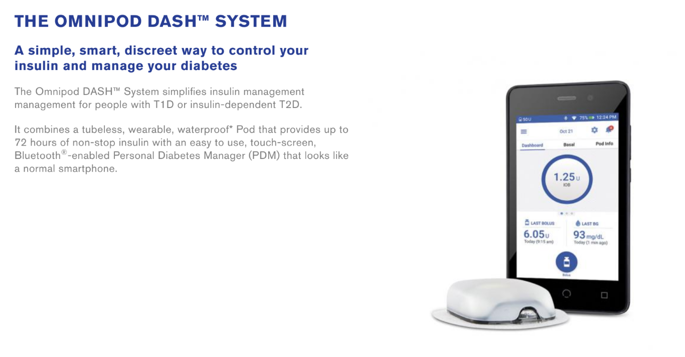

# Étape 3 : Compatibilité de la Pompe

!!!danger "Temps estimé"
    - Utilisateurs d’Omnipod : 3 secondes pour vous rappeler quel PDM vous utilisez.
    - Utilisateurs de Medtronic : 10 minutes pour mettre une batterie et consulter le modèle et le firmware
    - Autres utilisateurs de pompes : 5 jours pour envoyer un courriel à des amis leur demandant de vérifier les placards de leur ancienne pompe Medtronic ou d’appeler votre assurance pour commencer l’autorisation préalable pour Omnipod

!!!info "Résumé"
    - If you have a big clunky PDM with built-in BG meter...you can use your pods for Loop.
    - If you have a slim touch screen android-looking PDM...you can NOT use your pods for Loop.
    - Si vous avez une pompe Medtronic, vérifiez dans la liste pour vous assurer de la compatibilité des modèles/firmware.

!!!warning "FAQs"
    - **« Comment puis-je trouver une pompe Medtronic compatible ?** Cette question est traitée dans la section Détails supplémentaires ci-dessous.
    - **« Quelles sont les différences entre les modèles de pompes Medtronic ? »** cette question est également répondue dans la section Détails supplémentaires ci-dessous.
    - **« Mais qu’en est-il des autres types de pompes? »** trop mauvais, si triste ... sauf s’il s’agit d’une DanaRS, DanaR, Accu-Chek Insight, Accu-Chek Combo. Si vous avez une de ces pompes, vous pouvez consulter [le système de boucle AndroidAPS](https://androidaps.readthedocs.io/en/latest/index.html) au lieu de Loop. Si vous avez un Medtronic 512 ou 712, vous pouvez consulter [OpenAPS](https://openaps.readthedocs.io/en/latest/) car ce système prend en charge les modèles 512 et 712 en plus des autres pompes Medtronic compatibles Loop. Neither of those systems currently support Omnipod for looping.
    - **« Puis-je changer le firmware de ma pompe Medtronic ?** Travaillez-vous chez Medtronic avec des accès interne aux outils confidentiels et aux différentes versions de firmware pour faire ça ? Vous pourriez perdre votre emploi, mais je parierais que vous pourriez le faire alors. Nous n'avons cependant pas accès à cela.

## Vérifier la version de la pompe

Il s’agit d’une étape assez simple ... vérifiez que vous avez une pompe compatible pour utiliser Loop :

* Medtronic 515 ou 715 (n'importe quel firmware)
* Medtronic 522 ou 722 (n'importe quel firmware)
* Medtronic 523 ou 723 (firmware 2.4 ou inférieur)
* Medtronic "Monde" Veo 554 ou 754 (firmware 2.6A ou inférieur)
* Medtronic version Canadienne / Australienne Veo 554 ou 754 (firmware 2.7A ou inférieur)
* Pods Omnipod "Eros"

Si vous avez l’une des pompes énumérées ci-dessus, vous êtes bon pour aller sur Loop! Félicitations !

## Détails supplémentaires sur les Medtronic

Il existe un certain nombre de pompes à insuline Medtronic fabriquées entre 2006 et 2012 qui sont compatibles Loop.  La compatibilité a deux pré-requis : (1) le modèle de pompe et (2) le firmware.

### Modèle de pompe Medtronic

Pour déterminer le modèle de votre pompe, regardez à l'arrière de votre pompe.  Il devrait y avoir un autocollant sur le dessous de la pompe.  Sur le côté droit de l'autocollant, c'est écrit REF MMT-XXXXXX

!!!note ""

    MMT ---> Modèle de fabricant de pompe (MiniMed Medtronic) 
    722 ---> Numéro du modèle de pompe 
    NA ---> Région de la pompe (NA=Amérique du Nord, Amérique du Nord, CA=Canada/Australie, WW=Monde) 
    S ---> Couleur de la pompe (S=Fumée, L=Clair/Lucite, B=Bleu, P=Rose/Violet) 

Certaines pompes peuvent avoir un « L » ou « S » ou « R » avant la région de la pompe, par exemple un numéro de modèle comme MMT-722LNAS.  Cela n’affecte pas la compatibilité avec loop.

### Firmware de la pompe Medtronic

Le firmware (ou micrologiciel) d’une pompe est le logiciel interne qui exécute votre pompe.  Les anciens firmwares Medtronic permettent à Loop d’agir comme une « télécommande » pour définir des debits basaux temporaires et récupérer les données de la pompe.  Les firmwares plus recents ont désactivés ce mode d'accès « télécommande  et ne peuvent donc pas être utilisé avec ce système "fait le toi meme" (DIY) de boucle fermée.  Il n’y a actuellement aucune possibilité de revenir à une ancienne version du firmware d’une pompe ou de le remplacer par un firmware plus ancien.  Avant d'acheter une pompe d'occasion, assurez-vous d'en obtenir une avec un firmware compatible.

!!!note ""

    Les firmwares de toutes les pompes Medtronic 515/715 et 522/722 sont compatibles avec Loop. Il vous suffit de vérifier la version du firmware pour les pompes Medtronic 523/723 et 554/754.  
    + Medtronic 515 ou 715 --> tout firmware 
    + Medtronic 522 ou 722 --> tout firmware 
    + Medtronic 523 ou 723 --> firmware 2.4 ou inférieur 
    + Medtronic Monde Veo 554 ou 754 --> firmware 2.6A ou inférieur 
    + Medtronic Canadien/Australien Veo 554 ou 754 --> firmware 2.7A ou inférieur 

Pour trouver le firmware de votre pompe, vous devrez l'allumer. Si la pompe n’a pas été mise sous tension depuis un certain temps (c.-à-d. qu’elle a été entreposée sans batterie depuis un certain temps), elle se passera par une étape de démarrage et la version du firmware apparaîtra en bas à droite de l’écran de la pompe.  Ne vous retournez pas, car le numéro de version ne sera affiché que pendant un court instant avant que l'écran n'affiche d'autres informations.

Si la pompe a été active récemment ou a un réservoir installé, suivez ces étapes :

1. Appuyer sur le bouton  de votre pompe.

2. Faites défiler vers le bas avec le bouton  vers le bas de l'affichage des statuts.

3. Lire la ligne du bas de l'écran.

### Les différences de pompes Medtronic

Si vous êtes en mesure de récupérer autour de vous différent modèles de pompe, il y a de légères différences entre les pompes Medtronic compatibles Loop.

500 vs 700:  La différence entre la série Medtronic 500 et la serie 700est la taille du reservoir d'insuline.  Les pompes de la série 500 utilisent un réservoir de 180 unités, et les pompes de la série 700 utilisent un réservoir de 300 unités (ou un réservoir plus petit de 180 unités, si vous voulez).

x15/x22 vs x23/x54:  la différence entre les pompes x15 and x22 et les series x23 and x54 n'a que quelques mentions notables:

* Les pompes x23/x54 permettront de plus petites injections d’insuline dans certaines situations, si le taux de défilement plus petit est sélectionné dans le menu Bolus>Setup>Scroll Rate.  **Loop aura l'injection d’insuline automatiquement arrondie par la pompe aux unités disponibles dans le modèle de pompe, et tous les ajustements plus petits (pour rattraper l’arrondi) seront effectués grâce à l’utilisation des débits basaux temporaires par Loop.  Si vous voulez de plus petits increments pour les taux basaux, vous pouvez toujours saisir ces valeurs dans les paramètres de l’application Loop et Loop utilisera ces valeurs pour les calculs d'injection d’insuline.**

| Pump Model                  | Basal increments       | Bolus increments         | Range                                                                              |
| --------------------------- | ---------------------- | ------------------------ | ---------------------------------------------------------------------------------- |
| 515/715 and 522/722 | 0.05 0.1           | 0.1 0.1              | deliveries of less than 10 units greater than 10 units                         |
| 523/723 and 554/754 | 0.025 0.05 0.1 | 0.025  0.05  0.1 | between 0.025 to 0.975 units between 1 to 9.95 units greater than 10 units |

* Additionally, because of the way Loop fetches information from the pump, the x23/x54 series of pumps are slightly better at conserving battery life through the use of the MySentry packets to collect information from the pump.  x22 pumps do not use MySentry.

* The x23/x54 series pumps are also faster at delivering boluses greater than 10 units.  On an x23 pump, a 13-unit bolus takes 5:00 minutes to complete.  On an x22 pump, a 13-unit bolus takes 8:40 minutes to complete.

### Finding a Medtronic pump

Finding a compatible Medtronic pump is probably the most difficult part for most new Loopers.  Our suggestion:

* Talk to friends in the diabetic community.

* Ask your endocrinologist.

* Ask at a local JDRF chapter meeting if someone has an old backup pump they'd be willing to donate to you.

* Join diabetic supply groups on Facebook; both for-trade and for-sale groups.

* Check Craigslist often and be willing to expand your search area to include larger cities.

* Check out the **HelpAround, NextDoor, OfferUp, and/or LetGo** apps for pumps.

* Search [Medwow](http://medwow.com) for used Medtronic pumps.

Medwow has been fairly frustrating for most people; poor response rate and high prices.  The most success appears to come from either one-on-one discussions with fellow diabetics/doctors or using apps (Craigslist, NextDoor, LetGo, HelpAround).  If you are using Craigslist, you may wish to use an app on your iPhone to make the searching easier.  There are apps to search multiple cities at once for your keywords and set up alerts.

### Safe Purchasing

If you choose to purchase from a remote or unknown seller, here are some tips for safe purchasing:

* Use PayPal and purchase using the "Goods and Services" payment option. This costs nothing for the buyer, but the seller will lose 2.95% of the sale to PayPal fees. PayPal offers some protection for both buyer and seller in the event of fraud.

* Ask for photos of the pump. Check to make sure the serial number of the pump on the backside matches the serial number of the pump showing in the display menu. Ask for a short video of the pump, or at least a photo of the pump turned on, so that you can see the pump's firmware and model number. Cracks and some wear on these pumps are expected. These pumps are not usually free of marks. Many people are successfully looping on pumps that have cracks and rub marks, but you may want to ask if you are concerned about any you see in photos.

* Beware if the bottom of the reservoir/motor sleeve has the drive support cap pushed out, as shown [here](/troubleshooting/pump-errors/#motor-error). Those pumps will generally not work (or only work intermittently), however some people have successfully repaired those pumps as shown in that link. Just be aware that it should be checked in advance.

* Repairs to cracks or missing bits of plastic on battery cap area and reservoir caps are possible and not very difficult in most situations. You can read more about how to repair those [here](/troubleshooting/pump-errors/#crackmissing-piece-repairs).

* Ask for shipping that includes a tracking number. USPS Priority Mail's smallest box is a great option.  It's only $7.20 domestically in the US and includes tracking. Ask the seller to add a small bit of packing protection such as bubble wrap around the pump to keep it safe during shipping. Make sure you get a tracking number within a reasonable period of time after you have paid.

Red flags that may indicate a scam:

* Asking for payment through "friends and family" on PayPal, especially if you don't know the person or have any solid references for them. Paying in that way offers you no buyer protection. It's just like giving the seller cash, so you had better trust the seller.

* Offering an "almost new" pump is a big red flag. These pumps should be at least 5-years-old by now. Do you really think a 5 year old pump should be unused and sitting in shrink wrap at this point? This seems highly suspicious. There are some out there, but they are very infrequent.

* Not able to provide new pictures of the pump when requested. Sure they posted some pictures with the ad, but what if they just downloaded them from other people's ads? The seller should be able to furnish a couple of "new" photos at your request. A good one to ask for is the battery and reservoir tops so you can see the condition of those.

### Pump Supplies

Medtronic will not typically sell pump supplies directly to customers who have not previously purchased a registered Medtronic pump. Ask your insurance about purchasing pump supplies through a durable medical equipment (DME) provider. Typically, the DME provider will coordinate with your insurance and doctor's office to get the necessary insurance approval and prescriptions for the supplies. If you are brand new to Medtronic infusion sites, you may want to ask for help from friends to try a variety of infusion sets before purchasing a full 90-day supply of any type in particular.

## Détails supplémentaires sur les Omnipods

!!!warning "Rappel et avertissement"

    Through the work of the DIY community, Insulet's Omnipod (Eros) system is now Loop compatible. Using Eros pods with Loop is not supported by Insulet. Do not call Insulet asking for help with your Loop build, setup, or operation. This project is not FDA-approved and you are using this project under your own responsibility and risk. Please read these documents and familiarize yourself with Loop before using.

### Eros

Eros pods were launched in 2013 and continue to be sold by Insulet. As far as we know, there have been no plans or timelines announced for the discontinuation of Eros pods for existing customers. Insulet doesn't specifically call these "Eros" anymore, they just use the term "omnipod system". For clarity, from [Insulet's webpage](https://www.myomnipod.com/about):

Eros system has that PDM we all recognize from the last several years.

### DASH

Insulet has announced their DASH system as an eventual replacement for Eros/Omnipod System. There has already been a limited release of DASH to a select group of users, with a wider public rollout of DASH expected in 2019. The DASH system has the newer, slimmer locked-android PDM and built-in BLE communications in POD. Loop will not be compatible with the DASH system.

## Next Step: Compatible CGM

Now you are ready to move onto Step 4 to check if you have a [Compatible CGM](step4.md).
