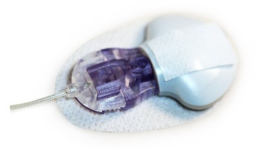

# Étape 4 : Compatibilité du MGC (CGM)

!!!danger "Temps estimé"

    - 10 minutes pour lire cette page

!!!info "Résumé"

    - Si vous utilisez un système CGM Dexcom G4 Share, G5 ou G6 ... vous êtes déjà prêt à utiliser Loop.
    - Si vous utilisez un capteur Medtronic compatible avec une pompe Medtronic, elle même compatible Loop, vous pouvez utiliser Loop.
    - Si vous avez un Eversense...vous ne pouvez pas utiliser Loop avec ce CGM.
    - Si vous utilisez un FreeStyleLibre...vous devrez utiliser une version modifiée de Loop

!!!warning "FAQs"

    - **"Qu'en est-il des capteurs Libre ?"** Les capteurs Libre ne sont pas conçus pour être des moniteurs de glucose en continu. Toute utilisation de capteurs Libre comme moniteurs de glucose en continu implique l’utilisation d’applications tierces (Xdrip ou Spike) et de lecteurs (BluCon ou Miao Miao). Les développeurs de Loop n'ont pas vu de données démontrant des protections suffisantes de ces lecteurs et applications pour se sentir à l'aise en ajoutant l'intégration dans le code principal de Loop pour ces appareils. Si vous utilisez un capteur Libre, vous devrez utiliser une branche « non-principale » de Loop que quelqu’un (ou vous-même) a modifiée pour permettre une utilisation avec ces capteurs/applications.
    - **"Qu'en est-il d'Eversense?"** L'application d'Eversense ne s'intègre pas avec Apple Santé, et les protocoles de communication pour Eversense n'ont pas été décompilé / analysé par ingénierie inverse non plus. Par conséquent, Eversense n’est pas compatible avec l’utilisation loop actuellement.

Un moniteur de glucose continu (CGM) fournit à Loop des lectures en continu de glycémie. Ces lectures permettent à Loop de prédire quelle est la tendance actuelle de glycémie et de prédire la glycémie future en fonction de l’entrée des glucides et des paramètres que vous avez saisies à Loop. Voici les types de CGMs compatibles avec Loop. Les lectures de CGM sont une partie requise du faire fonctionner Loop. Si votre Loop n’est pas en mesure de récupérer les données de votre capteur, elle ne sera pas en mesure de boucler.

## Les CGM Dexcom G5 et G6 

Avec les Dexcom G5 et G6 votre iPhone reçoit les données MGC directement via l'application Dexcom en Bluetooth. Aucun de ces deux systèmes ne nécessite l'utilisation d'un récepteur autonome. Pour que Loop fonctionne, vous aurez besoin de l'application Dexcom en cours d'exécution.

## Le CGM Dexcom G4 avec Share Receiver 

Le système Dexcom G4 Share transmet les données CGM de l’émetteur au récepteur du Dexcom G4. Le récepteur, à son tour, se connecte à l'application Dexcom Share2 sur votre iPhone via Bluetooth. L'application Share2 télécharge des données CGM vers les serveurs Dexcom. Pour que Loop fonctionne, vous aurez besoin de l'application Dexcom en cours d'exécution.

## Les CGM Medtronic 

Le CGM Minimed Enlite, disponible avec le Medtronic 522/722, 523/723 et 554/754, envoie des lectures de glycémie à la pompe. Loop peut lire les données CGM Medtronic directement à partir de la pompe à l’aide du RileyLink.

## Utilisation hors ligne

L'utilisation hors ligne signifie utiliser la boucle lorsqu'il n'y a pas de données cellulaires ou d'internet disponible. La boucle ne nécessite aucune configuration spéciale pour fonctionner hors ligne. Vous n’aurez pas besoin de faire quelque chose de spécial si vous allez camper ou vous retrouver dans le désert. Pour une utilisation hors ligne de Loop, le Bluetooth de l’iPhone doit toujours être actif; et pour les utilisateurs de Dexcom, l’application Share2, G5 ou G6 doit également être ouverte (mais n’a pas besoin de « partager » activement via Internet). Si vous mettez votre iPhone en mode Avion, n’oubliez pas de réactiver le bluetooth pour maintenir votre Loop en marche. Si votre utilisation hors ligne échoue, il y a des chances que vous ayez oublié de mettre à jour votre identifiant de transmetteur dans les paramètres de la boucle lorsque vous avez changé d'émetteurs.

## Serveurs Dexcom

Dans de rares cas, Loop peut échouer à écouter les transmissions Bluetooth des systèmes CGM.  Quand cela se produit, Loop peut passer directement par les serveurs Dexcom pour obtenir les données (en supposant que vous ayez entré les informations de votre compte de partage dans les paramètres Loop et que le Partage soit activé). Lorsque Loop fonctionne dans ce mode, vous verrez un petit nuage dans les chiffres du CGM dans l’application Loop. L’utilisation de ce mode nécessite une connexion Internet ou cellulaire fonctionnelle.

## Les CGM non nativement supportés dans Loop

Libre (avec BluCon ou Miao Miao), Eversense, Medtronic Guardian sensors, etc. Oui, il y a d'autres systèmes CGM disponibles sur le marché. Loop ne prend pas en charge ces CGM.  Si vous souhaitez utiliser l'une de ces CGM avec Loop, ... vous devrez examiner les intégrations de tiers pour permettre à Loop d'accéder aux données de glycémie.  Ces documents ne couvrent pas les méthodes alternatives des systèmes CGM non pris en charge ou des applications comme Spike.

## Prochaine étape: Commander un RileyLink

Maintenant, vous êtes prêt à passer à l’étape 5 [commander un](step5.md)RileyLink .
