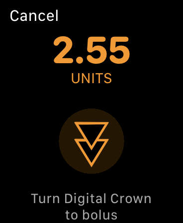

# FAQs sur les branches

Cette page est surtout adaptée aux personnes qui ont déjà construit l'application et qui reviennent ensuite pour mettre à jour. Au cours de la mise à jour, vous vous demandez peut-être quelles sont les différentes branches, quelles sont les différences, etc., alors essayons de répondre au mieux à certaines de ces questions.

## Qu’est-ce que les branches?

Oui, il y a beaucoup de « branches » dans Loop à discuter, mais le concept est simple. Je vais utiliser une analogie pour vous aider. En gros, ce sont des versions légèrement différentes de Loop...un peu come les différentes editions du même livre.

Pour bien comprendre ce que sont les branches, nous devrions probablement en expliquer un peu plus sur le code de Loop, et comment fonctionne le développement.  Vous pouvez regarder l’explication vidéo de ce processus [ici](https://www.youtube.com/watch?v=cWqvYs4Azt0&t=4s).

Les développeurs de Loop possèdent un compte GitHub appelé [LoopKit](https://github.com/LoopKit).  Avec ce compte, les développeurs ont plusieurs "dépôts" qui comportent en particulier Loop . Un dépôt est comme un livre...Imaginer pour le moment que c'est comme un livre de cuisine. A l'intérieur du compte LoopKit, il y a des dépôts pour Loop lui-même, LoopDocs et divers autres « frameworks » qui sont des dépôts d'aide pour Loop pour qu'il se compile correctement. Par exemple, le dépôt de Loop a beaucoup d'informations sur l'application elle-même ; les interfaces/écrans avec laquelles vous interagissez. Comment les informations vous sont transmises et récupérées ... c'est dans le code du référentiel Loop. Mais il y a plus qu'une simple interface utilisateur pour Loop. Loop doit faire beaucoup de travail complexe comme les communications Bluetooth, algorithmes mathématiques, communications de pompe, etc. L’application Loop s'appuie sur des frameworks pour faire ces autres parties. Le framework CGMBLEkit pour certaines parties relatives à l'émetteur dans Loop, RileyLink_ios pour les gestionnaires de la pompe (parler aux pompes et décoder leurs informations), LoopKit pour l'algorithme sur les glucides et les courbes d'insuline, etc.

Lorsque vous construisez Loop, en arrière-plan, Loop récupère ces autres frameworks (7 au total) et les intègre dans le processus de construction en utilisant "Carthage".  Carthage est comme un client personnel. Vous lui donnez une liste de courses (le panier dans le code Loop est cette liste de courses) et il va les chercher pour vous pendant le processus de construction. Parfois, votre ordinateur possède une vieille liste de courses... et cela peut causer des erreurs de compilation. D’où le correctif « carthage update » dans la page d'Erreurs de construction... Cette commande met à jour la liste d’achats pour obtenir les bonnes versions de ces frameworks.

De toute façon... donc maintenant vous connaissez la structure générale de Loop et LoopKit dans Github. Maintenant nous pouvons discuter de Loop un peu plus profondément.

Alors imaginons Loop comme un livre de cuisine. Les développeurs sont les auteurs/chefs des recettes (code) dans le livre de cuisine. Les auteurs passent d'innombrables heures à tester de nouvelles recettes, à tester leurs goûts, à documenter les améliorations. Ils envoient les brouillons à l'éditeur, qui fait des suggestions et éventuellement le livre de recettes est finalisé. Il n'y a pas de problèmes de grammaire, pas de fautes de frappe, les photos sont belles et les recettes sont délicieuses. Ils publient le livre et vous voyez un magnifique produit final sur les étagères. C'est ce qu'on appelle une "release" et c'est la branche principale (Master). Ce livre a été bien testé et est super stable. Chaque fois que vous cuisinez avec ces recettes, Vous savez exactement ce que vous obtenez et beaucoup de gens ont eu une chance avant vous de vous assurer que tout a bon goût. La branche principale est stable et testée.

Mais alors... les chefs/développeurs partent en voyage. Ils sont inspirés par la nouvelle cuisine et veulent ajouter de nouvelles recettes à l'ancien livre de cuisine. (Les choses comme le support de l'omnipod et les surcharges sont de nouvelles "recettes" qui ont été développées depuis la dernière version principale, par exemple.) Mais le processus de mise au point d'une recette est ardu. Beaucoup d'essais et d'erreurs ont été commis. Nombreux sont les ingrédients de mise à jour (code). Les éditeurs essaient les nouvelles recettes et proposent des retours (similaires à la liste des problèmes [dans GitHub](https://github.com/LoopKit/Loop/issues)). Pendant que les recettes sont en cours de développement, ils se base sur une version de l'ancien livre de cuisine qui est marqué... avec plein de modifications au crayon. avec des gribouillis et notes sur le côté. Les versions se produisent fréquemment, car c'est de cela qu'il est question de tester de nouvelles recettes. Ces versions marquées du livre de recettes sont appelées branche "dev". la version courte du terme: la branche de "développement". Comme son nom l'indique...c'est là que se produisent de nouveaux développements, de nouvelles recettes et des ajustements.

Après de nombreux tests et ajustements, éventuellement les recettes ont les bonnes saveurs (les bogues dans le code sont corrigés) et suffisamment de personnes ont fourni des commentaires et des observations prudentes sur les résultats. .que le livre va à la maison d'édition pour l'impression suivante. Le livre de recettes est réedité avec un numéro d'édition mis à jour et de nouvelles recettes sont mises en avant. Quand cela se produit dans Loop, la branche principale de Loop's est mise à jour avec les nouvelles fonctionnalités provenant du dev (on dit, « la branche dev est fusionnée dans la branche master »). Quand cela se produit, la branche master obtient une autre version "release" (vous pouvez voir l'historique de publication [ici](https://github.com/LoopKit/Loop/releases)) et a ce moment la... les branches dev et master sont exactement les mêmes. Ils restent les mêmes jusqu'à ce que les développeurs de Loop commencent à travailler sur le prochain lot d'améliorations, cela peut être l'heure suivante ou des jours plus tard, mais le processus recommence. Les développeurs vont commencer à modifier le code à nouveau et laisser tomber ces modifications dans la branche de développement pour un développement ultérieur.

## Qu’est-il arrivé à la branche Omnipod-test ?

Les tests de développement d'Omnipod Loop (sans parler du travail de piratage qui a précédé cela) ont été effectués par un groupe plus restreint de personnes en privé pendant des mois et des mois avant la publication publique de la branche de test de l'omnipod. Ce petit groupe de personnes (plusieurs dizaines de personnes) regardaient activement leurs boucles Omnipod et capturaient les rapports de bogues. Il y a eu beaucoup de travail des testeurs et de Pete Schwamb (développeur Loop) pour obtenir le code assez stable et fiable.

Quand le code est arrivé à un état stable et fiable et était prêt pour un plus grand public, La branche omnipod-testing a été mise à disposition en tant que branche « test public ». Cette branche a été assez bien testée avant la publication publique, mais ne sera pas nécessairement parfaite pour tout le monde. On s'attendait à ce que certaines requêtes d'interface utilisateur soient demandées après avoir reçu un public plus large des utilisateurs.

De plus, la branche omnipod-testing n'allait pas subir beaucoup de révisions actives lors de sa sortie. Le but était de le conserver comme un produit relativement connu et inchangé pour les gens plutôt que comme un jeu de code en constante évolution. .de cette façon si les gens notaient un bogue, ce serait une base de code plus « connue » pour travailler au débogage.

La branche de test Omnipod a servi de plate-forme initiale pour tester la Loop avec les Pods. Elle a été officiellement retirée maintenant et n'est plus nécessaire. Le support Omnipod a été intégré dans les branches master et dev normales.  Je vous remercie, branche omnipod-testing ... vous nous avez bien servi. Bonne retraite.

## Loop v2.0

Le 31 décembre 2019, Loop a publié la version 2.0 de Loop (on dit aussi « Loop a eu une mise à jour de la branche Master »). Cela signifie que le livre de recettes de la branche dev (pour utiliser notre analogie antérieure) a été fusionné avec le maître. Le 31 décembre, les branches master et dev étaient identiques.

À partir de cette date, cependant, la branche dev va recommencer à être travaillé avec des nouvelles recettes. La branche Dev recommencera à se différencier de la branche master avec des changements non testés et le développement d'un nouveau code. La branche Dev peut commencer à avoir quelques bugs et régressions en raison des changements de code qui se produiront sans beaucoup d'annonce ou de discussion.

Donc, la plupart des utilisateurs devraient maintenant recommencer à construire à l'aide de la branche master ... ou obtiendra la dernière version de Loop à chaque fois que vous construirez avec la branche Loop master. Cette branche restera dans le même état de stabilité que celle qu'elle a été depuis un certain temps. N'utilisez la branche de développement que si vous êtes intéressé pour tester activement le nouveau code et que vous avez la possibilité de suivre/documenter les bogues.

## Quoi de neuf dans Loop v2.0?

Cette question est très populaire et cette version se présente sous quelques formes...

Quoi de neuf dans Loop v2.0? Quelle est la différence entre la branche Loop v2.0 et la branche dev ? Dois-je mettre à jour si j’utilise la branche dev maintenant?

La question de savoir quelles différences quelqu’un remarquera entre son application Loop existante et la nouvelle version... eh bien, je ne peux répondre que si je savais quelle version / branche que vous utilisez actuellement (ET quelle date vous avez construit sur si vous utilisez dev branche). Parce que la branche de dev change si souvent, la version que quelqu’un utilise à partir d’octobre 2019 ne sera pas nécessairement la même que la version que quelqu’un a construite en novembre 2019.

Donc, je vais faire une déroulé des nouveautés comparé à la dernière version et vous pouvez vérifier si l'un d'entre eux vous semble "nouveau" en fonction de la version de Loop que vous utilisez. Ils sont répertoriés à peu près dans l’ordre inverse de quand ils ont été fusionnés en dev, de sorte que plus c'est haut dans la liste, plus il y a de chance est que vous n’ayez pas encore vu la fonctionnalité.

### Téléchargement des glycémies vers Nightscout

Loop v2.0 a une option pour envoyer vos données de glycémie directement sur Nightscout. C'est un nouveau slider dans la section de configuration de la MGC pour les utilisateurs de Dexcom. Après avoir ajouté votre identifiant de transmetteur MGC, retournez dans les informations du MGC et vous verrez un nouveau curseur appelé "Télécharger des lectures"  Techniquement, la branche de développement de Loop avait cette fonctionnalité est sortie peut de temps avant la sortie de Loop v2.0. ...mais pour presque tout le monde ce sera une toute nouvelle fonctionnalité qu'ils n'ont pas eu auparavant. Cette fonctionnalité peut aider si les serveurs de Dexcom Share traversent une autre panne comme rencontrée précédemment. Si cela se produit, vous pouvez activer le bouton "Envoyer les lectures" et vos données MGC seront maintenant dans Nightscout même si les serveurs Share ne fonctionnent pas correctement. Good practice would be to temporarily disable your Share bridge in Nightscout while Loop is responsible for CGM uploading so that you don't get duplicate data. You can disable Share bridge by logging into your Heroku account, going to the Settings tab, clicking on "reveal config vars" and then deleting the word "bridge" from the ENABLE line.

### A fix for settings loss

iOS 13 brought about a quirky little bug where you could suddenly lose settings in Loop. But, it wasn't just limited to Loop, sometimes people lost Dexcom app settings too. The issue is most common when the phone goes through a power cycle, but it has happened at other times, too. There's a fix for that new bug in Loop now...so that's a good reason to update. (If you encounter that bug before you have a chance to update your Loop app, simply restart the Loop app and your settings should reappear.)

### Spin for Watch Bolus

To prevent an accidental bolus from your Watch app, don't let your kids hold your watch. Just kidding, we've added an even better option. There is a new "spin" to confirm the bolus after you press the bolus button. You'll see a graphic like below on the watch face. As you spin the digital crown, the two triangles will begin to merge. Once they merge, the bolus is confirmed through a little haptic and a white checkmark will appear on the watch screen.

### Watch recommended bolus

A common code customization is also now no longer needed. Many people used to edit Loop code to have the Watch app provide 100% of the recommended bolus as the auto-filled quantity in the bolus field (default used to be 75%). Loop now offers the 100% auto-filled recommendation, no code customization needed now.

### Recent carbs list on Watch

You can review the recent carb entries on your Apple Watch now. Simply swipe left to see the blood glucose graph screen on your watch. Scroll down with the digital crown to the "active carbs" row beneath the graph, and tap that row. You can see the list of recent carb entries.

### Fix for Medtronic x15 "bolus may have failed" message

A lot of Medtronic x15 users received "bolus may have failed" messages after each bolus. That issue has been fixed and a patched version of Loop is no longer needed. All good!

### Confirmation beeps expanded

Confirmation beeps have been expanded based on user feedback...we heard parents and school nurses really appreciate hearing a beep for not just boluses, but also for suspend/resume commands and editing basal schedule (so you are sure it saved properly). So, confirmation beeps are now for boluses, suspend/resume, and basal schedule edit saves.

### Read Pod Status added

There's a new command in the RileyLink menu for "Read Pod Status" that is analogous to the existing command for Medtronic users. You can query your Pod for its current status info using that command.

### Bug fixes generally

There are a lot of niggly little bug fixes too which were merged in the last couple weeks. The temp basal timestamp for Medtronic Loop (and for older Omnipod Loops, too) had a bug that when Loop reverted to scheduled basals, the timestamp on the HUD's temp basal icon would switch back to the time the Loop was launched (instead of the time the scheduled basal was started again). There are also some new code improvements for handling uncerain boluses for Pod  Also, there are improvements to handle how Loop marks Pod suspend commands that are initiated by users while an active temp basal is in progress.

### User interface improvements

You'll notice dashed lines in the HUD for the CGM value if the CGM data goes older than 15 min (that way you don't accidentally miss the fact that your CGM has failed). The API Secret is hidden after it is saved in Loop Settings now, and if you accidentally leave a trailing slash on the Nightscout URL...Loop will ignore it.  The bolus progress row is new to master branch now, although many of you have been accustomed to that visual in dev branch for awhile now. The "Scenarios" screen that would sometimes appear when a phone was shaken is also disabled by default now. The Issue Report has more information about your Loop app's build date and version so that you can more easily track its build history.

### Common build error squashed

One common build error was caused if there was a space in the Loop folder name after downloading. This problem has been fixed and you will no longer get build errors if you have a space in your Loop folder name.  Ahhhhh! I love it!!!

### Nightscout profile uploading

Loop will upload your basal schedule, ISFs, carb ratios, and override presets from Loop settings to your Nightscout profile. If you ever lose your phone and need to setup Loop brand new...your settings will be easy to find in Nightscout now.

### New languages

Japanese, Danish, Swedish, Vietnamese, Finnish, Portuguese (Brazilian), Polish, and Romanian languages were added to the regional translations for Loop. There are definitely some missing strings that will still need touchups...we will get those fixed up in Loop v2.1 if you all [help report those when you see them](https://www.facebook.com/groups/TheLoopedGroup/permalink/2454410898108895/). Thanks!!

### Non-linear carb model

All branches (master and dev) now use a "non-linear" carb model, so let's give some info about the change.

Previously, the carb model Loop used had a linear absorption predicted with dynamic carbs adjustments. But looking at large groups of meals' datasets (and supported by personal, anecdotal experiences), food really has a bit more of a non-linear absorption. Meaning, we usually see more of a food impact up-front than the old carb model in Loop predicted. What this means is that food absorption was modeled as a flat, even effect (like the straight grey graph that you'll see in the [Insulin Counteraction Effects chart](../operation/features/ice.md) after you added a carb entry.

What did that mismatch mean for us if the model predicts a linear absorption, but the meal actually behaves differently?

1. Bolusing: You've probably seen smaller upfront boluses for meals than you would have preferred. This is because the insulin was predicted to over-power the linear (slower) carb model soon after a bolus is given.
2. Early low temp basals: You've also probably seen a tendency to have early zero basal or low basals set by Loop for the first 30-60 minutes after a meal bolus if you don't have a significant blood glucose spike immediately after the carb entry. This might have been even more obvious for those of you who are regularly waiting to eat after a bolus, too.

With a non-linear absorption model, the carb absorption will more closely match observed blood glucose impacts we've seen after meals. And when the model is more closely matching actual experience, that means the predicted blood glucose curves will do a better job at providing more upfront bolus and not having the tendency to have overly conservative temp basals soon after a meal.

**What should you expect?** Like the description above, you'll likely see more complete bolus recommendations and less low temping after a bolus. With that in mind, if you've made adjustments to your Loop habits or settings to overcome those issues previously, you may want to undo those habits. Like if you shortened carb absorption times to help get larger boluses upfront, you may want to go back to standard times. Keep an eye on things and you should adjust as needed.

**What if you want to go back to the old model?** You will have to edit a line in LoopKit's LoopKit code [here](https://github.com/LoopKit/LoopKit/blob/dev/LoopKit/CarbKit/CarbStore.swift#L207) to use `.linear` if you wanted to go back to the old carb model. If you want to read more about the model, please check out the [Zulipchat thread here](https://loop.zulipchat.com/#narrow/stream/144111-general/topic/Possible.20Carb.20Model.20Changes). But realize that the code edit for changing models would be easiest done using a [LoopWorkspace](../build/loopworkspace.md) because the edit is in one of the frameworks that Loop uses (rather than Loop code itself), so this is one of those instances where you will have to do some work to learn how to use a LoopWorkspace properly.

### Overrides

Loop v2.0 marks the first time Loop master branch has overrides included. Additionally, this release moves overrides setup from the configurations area of Loop settings to the workout icon in the Loop toolbar. There has also been bug squashing in dev branch for overrides over the recent past, so updating is a good idea even if you already have overrides on your current build. Want to learn more about overrides? Read about them [here](../operation/features/workout.md).

### Retrospective Correction always on

Retrospective correction used to be an optional toggle in the algorithm. It is now on by default all the time. It is an important part of the algorithm (helps Loop look at how good/bad its recent prediction curve has been vs reality), and leaving it on made sense anyways.

### Omnipod support

Yes, most of you are already using Omnipod with your Loop...but this is the first time that Loop master branch supports Omnipod users. Please update if you have been using Omnipod-testing branch especially...it's time to get all the bug fixes that we've done in Loop.

### Dark mode support

iOS 13 brought dark mode for application developers, and Loop's developer was all over that. We now have a wickedly cool dark mode Loop for those who prefer the dark side.

### ISF and correction range guardrails and UI change

Loop v2.0 also brings about the first time master branch has the useful scroll wheel to set values of ISF and correction range. This helps mitigate an old bug where backwards entered correction range values would crash Loop app. Also less prone to fat-finger mistakes on entry.

### Simulator pump and CGM

If you don't have compatible gear yet and just want to test Loop app, the new ability to add a simulated pump and/or CGM is a great new feature.

### New style of Dexcom transmitters supported

Dexcom launched a new style of transmitters this summer. The new transmitters took some work by Loop developer (PETE! YEAH!) to get them working in offline Looping, but the fix was pushed into all branches shortly thereafter in August 2019. If you haven't updated your Loop since August 2019 and use a Dexcom G6, you should update now.

## How can I stay current with what's going on in the branches?

Like we said earlier, master branch won't really be changing much. You don't really need to watch that one for changes.

But, dev branch is a constantly shifting, moving place. If you choose to come into a dev branch build...you need to be aware that is what dev does...moves, shakes, changes, and will update code frequently and unannounced in the traditional sense that most users in Looped group or Instagram would see. Developers are not helped by people being in a dev branch if those users are mistakenly thinking of it as a stable master branch with lots of detailed docs to go with it. People should only use a dev branch build if they EDUCATE themselves on the expectations and how to properly manage dev information and updates. People using dev branch should also have regular access to a computer to be able to rebuild quickly if a new bug/fix is identified.

If you choose to use a dev build, you can stay abreast of developments in a number of ways...but they will all require you to do some legwork and keep yourself informed. This is not a situation where you should expect a fancy Loopdocs page updated regularly with current "dev updates"...that's just not the way dev branch works.

### Watch the Loop Repo and Issues list

First, subscribe to the Loop repo's Issues list by "watching" the [Loop repo](https://github.com/LoopKit/Loop). You can choose to watch the repo so that you get emails when new Issues are reported. This is a good way to find out if there's other people reporting odd behavior that you are wondering about. If you use dev and wonder about something you are seeing in Loop, you can check [Issues list](https://github.com/LoopKit/Loop/issues) to see if others are noticing the same. If so, you can help by capturing information and reporting it. Not super helpful to just say "yeah, me too..." but better if you can attach screenshots, Issue Reports from Loop settings, and a thorough description of the problem you are seeing. Be a part of the solution by thoughtfully providing information to help debug.

### Subscribe to the Zulipchat channels

Second, use [Zulipchat](https://loop.zulipchat.com) forums for Loop. This forum has several "streams" of conversations depending on interest. I highly recommend following the #github channel if you are wanting to watch for code changes. Code changes are called "commits" in GitHub. The #github channel will have an automated post whenever a new commit is made and it will give a brief line description of the commit.

You can also go directly to the commit history for each of the branches if you'd like.

[Loop master branch commit history](https://github.com/LoopKit/Loop/commits/master)

[Loop dev branch commit history](https://github.com/LoopKit/Loop/commits/dev)

If you click on the commit, you can see exactly what changes to the code were made. It's an interesting learning experience. In red are the code that is old, in green is the updated code. The line numbers and file names of the edited code are also there to help.

I don't expect many of you would understand exactly what the edits mean, or how the new code might function...but I bring up the topic of commit history so that you can use that to realize just how often dev is updated. Go ahead and look at the number and frequency of commits in that dev branch...that is why there is no way someone is going to keep a "loopdocs" of dev changes. It's just too much a moving target.

### Keep checking Looped group

Third, keep watching Looped group. Major concerns/issues are brought up there...so no harm in scrolling through and seeing what's going on there.

### LoopDashboard.org

You can always check out the <a href="https://www.loopdashboard.org/">LoopDashboard</a>  which summarize all the github activities in Loops 7 different repositories for dev and master branches. Here you can always see the latest "news" and  the history of Loop.

On the first page of loopdashboard you can see all the activities in one list, but you can also go to other pages and see more details about commits, issues and pull requests. There are also stats about who is doing the pull requests and commits.  The dashboard is updated every 12 hours. The dashboard is updated every 12 hours.

### Become familiar with your data sources

Another useful thing if you'll be on dev branches undergoing a lot of active change...know how Loop works and where to look for additional information about what you are seeing. For example, if you see an IOB value that looks odd, you should know to look at the insulin deliveries are stored in Health app. Knowing to pull an Issue Report when you see a problem so you can provide that if asked. Knowing [how to capture debugging logs if the developers ask for that kind of info](https://youtu.be/Ac4MguvUO7M) is also a good skill.

## What is expected in the future?

Roughly speaking...right now (December 31st):

* Master: we know that there will need to be cleanup of the new translations. There were lots of new phrases and development with a lot of new languages, as well. Master (and dev) branch will be updated with fixes for the translations. When those translation fixes are done, there will be a Loop v2.1 released.

* Dev: Dev branch's future development is best tracked by watching and reviewing [pull requests in GitHub](https://github.com/loopkit/loop/pulls). This is the list where code changes are initially proposed and discussed.
